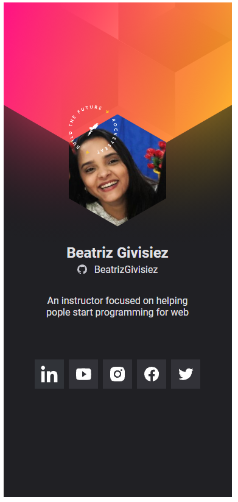

# NLW7 Heat - Mission: Origin
O NLW é um evento construído pela comunidade para a comunidade. 
Treinamento realizado pela [Rocketseat](https://app.rocketseat.com.br/) entre os dias 18 à 24 de outubro de 2021. Desenvolvemos uma aplicação front-end construindo um Crachá Virtual para aquecimento do evento DoWhile2021 – Um evento online e gratuito onde vamos construir o futuro através da programação.

## Material
Aulas: https://nextlevelweek.com/episodios/origin/aula-1/edicao/7  
Notion: https://www.notion.so/Origin-eb0705f8160f4c339f1b50da10fea05d  
Figma: https://www.figma.com/community/file/1031698737363668691

## Stage 1 – Aula prática
Nessa aula vamos conversar sobre oportunidades da programação WEB, conhecer as "soft-skills" necessárias para trilhar o caminho Dev, alinhar as expectativas na questão de mentalidade do nosso universo. Você vai ter conhecimento sobre o que é programar para WEB, front-end e já conhecer a parte técnica sobre HTML e CSS.

## Stage 2 – Aula prática
Nessa aula iremos revisar conceitos técnicos vistos na aula anterior, aprenderemos boas práticas de HTML, novos elementos, novos conceitos CSS, além de propriedades que irão dar ainda mais estilo ao nosso Front-end. Você irá finalizar toda a parte visual da sua aplicação ainda nesta aula.

## Stage 3 – Aula prática
Nessa aula você vai conhecer o JavaScript colocando a mão na massa para descobrir o poder dessa linguagem, criando ações na aplicação e conhecendo boas práticas usadas pelo mercado de trabalho.

## Stage 4 – Aula prática
Nessa aula você vai ter conhecimento sobre o que é API e JSON e como consumir uma API na prática com JavaScript. Você irá finalizar a aplicação e coloca-lá online para qualquer pessoa poder acessar.